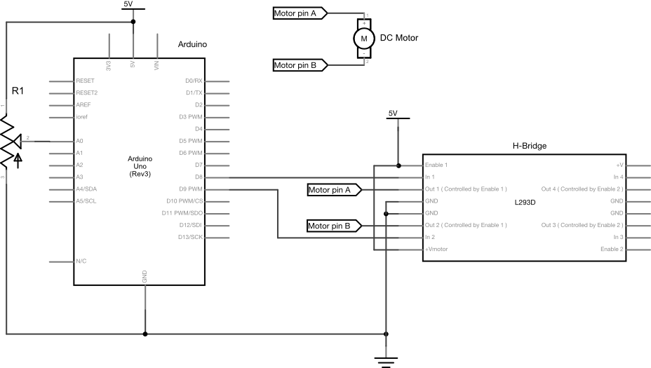

# Motorized Potentiometer Examples

These examples show how to use a Bourns PRM series potentiometer
e.g. [PRM162-K420K-103B1](https://www.digikey.com/product-detail/en/bourns-inc/PRM162-K420K-103B1/PRM162-K420K-103B1-ND/3780910).

An L293D H-bridge is used to control the motor of the potentiometer. 
Pins 1, 8, and 16 of the H-bridge are connected to the Uno's +5V. Pin 4 of the H-brodge is connected to ground. The motor's two pins are attached to pins 3 and 6 of the H-bridge. The H-bridge's control pins, pins 2 and 7, are connected to pins 4 and 5 of the Uno, respectively. The potentiometer's two outer pins are attached to +V and ground, respectively, and its center pin is connected to pin A0 on the Uno.

Images made in Fritzing and Illustrator CS.

_Figure 1. Breadboard view of an Uno and and Bourns PRM series potentiometer_

_Figure 2. Schematic view of an Uno and and Bourns PRM series potentiometer_
