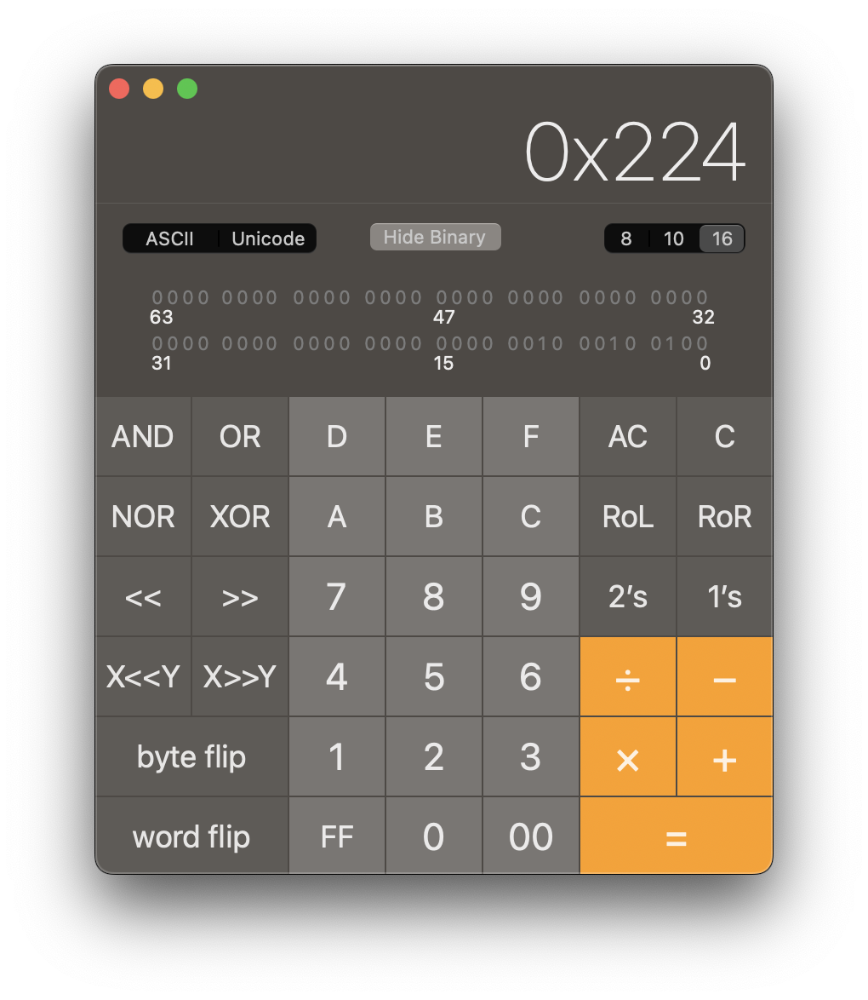

# Understanding the PMS5003 Data Protocol

This is a guide to reading and parsing the data from the [Plantower PMS5003 AQI sensor](https://www.plantower.com/en/products_33/74.html). This sensor has an asynchronous serial interface, so it's a useful example for understanding the structure of binary data protocols. In particular, this protocol contains a fixed header, a data length, and a checksum, all of which will be processed in the code in this explanation.

## Hardware Connection

The sensor sends its data over an asynchronous serial connection (UART). You'll need to read the data over a UART interface on your microcontroller and interpret the bytes.

Many Arduino boards (though not the Uno) have two UARTs. The first is the USB-Serial connection that you use to upload new code and to send information to the Serial port using `Serial.println()` and other serial commands. 

Table 1 shows the connections between the PMS5003 sensor and the Nano 33 IoT or MKR boards.

| Board | Sensor RX  | Sensor TX |
|--|--|--|
|Nano 33 IoT | Digital 1 (Physical pin 17; Nano TX) |Digital 0 (Physical pin 16; Nano RX) |
|MKR series |Digital 14 (Physical pin 23; MKR TX)|Digital 13 (Physical pin 22; MKR RX)|

_Table 1. Pin connections from sensor to microcontroller_

The second UART on any Arduino or compatible board is addressed as `Serial1` in code, like so:
```
Serial1.begin(9600);
Serial1.println("Hello");
```
 To connect to any UART-based device, the tramsmit pin (TX) of the sensor connects to the receive (RX) pin of the microcontroller, and vice versa. Voltage and ground for the sensor connect to voltage and ground from the microcontroller, respectively.

## Sensor Data Format

The sensor's [data sheet](https://www.aqmd.gov/docs/default-source/aq-spec/resources-page/plantower-pms5003-manual_v2-3.pdf) explains that the default serial data format is a 32-byte  packet, as follows:

| Byte No. | Meaning | Value | Property |
|---|---|---|---|
| 1 |Header Byte | 0x42 |
| 2 |Header Byte | 0x4D |
| 3 |Frame Length High Byte | variable |
| 4 |Frame Length Low Byte | variable |
| 5 |Data 1 High Byte | variable |
| 6 |Data 1 Low Byte | variable |
| 7-28 |Data 2-12 high and low bytes | variable |
| 29-30 |reserved | variable |
| 31 |Checksum High Byte | variable |
| 32 |Checksum Low Byte | variable |

_Table 2. Data Bytes of the PMS5003 Sensor Data Format_

> **Note:** in programming contexts, single-byte values are often written in base-16, or *hexadecimal* notation. In this notation, each digit has 16 possible values, 0-9 then A-F. The `0x` at the beginning indicates that a number is hexadecimal. It makes it easy to write each byte as a two-digit figure: 0-255 in decimal notation is 0-FF in hexadcimal. These notes will follow that convention.

If you have trouble converting from decimal to hexadecimal to binary, the MacOS calculator is your friend. Open it and press command-3 to get the programmer's calculator, as shown in Figure 1. 



_Figure 1. The MacOS calculator shown in programmer's calculator mode (command-3)_

To process the data coming in from the sensor, first you should write a test program to see that it looks like the data sheet describes. Then you can write a program to parse the data. 

## Reading the Serial Data

The data from the sensor will be sent over and over again via the UART. So the first thing you need to do is to look for the first byte, whose value in hexadecimal notation is `0x42`. 

You can do look for the first header byte as shown in the [simple_read_test]({{site.codeurl}}/EnvironmentalSensors/PMS5003_AQI_sensor/simple_read_test/simple_read_test.ino) program:

````arduino
void setup() {
  // Initialize both the USB serial port and sensor serial port:
  Serial.begin(9600);
  Serial1.begin(9600);
}
void loop() {
  // if there's incoming serial data from the sensor:
  if (Serial1.available()) {
    // read one byte:
    byte input = Serial1.read();
    // if that byte is the first header byte,
    // print a newline so you can see once  packet per line:
    if (input == 0x42) {
      Serial.println();
    }
    // print the byte no matter what it is:
    Serial.print(input, HEX);
    // print a space after each byte:
    Serial.print(" ");
  }
}
````

You should see output in the Serial Monitor like this:
```
42 4D 0 1C 0 1 0 3 0 3 0 1 0 3 0 3 1 59 0 64 0 12 0 4 0 0 0 0 97 0 2 24 
```
You can see the two header bytes, followed by 15 pairs of bytes. The bytes represent the values as explained in the data format above. To understand them, start with the first two after the header, the data length. They are `0 1C`. You can combine them into a single byte by multiplying the first byte by 256 and adding it to the second byte (this math is explained in more detail below). Since the first byte is 0, you just need the second byte, `0x1C`, which is 28 in decimal notation.  That means the data length is 28 bytes. Sure enough, 28 bytes follow the data length. So far, so good. Later, you'll calculate the data length in code to check.

## Parsing the Data

Now that you know the microcontroller is reading the data, write a new program to parse it. 
The full progam flow of [PMS5003AQISensorRead]({{site.codeurl}}/EnvironmentalSensors/PMS5003_AQI_sensor/PMS5003AQISensorRead/PMS5003AQISensorRead.ino) goes as follows:

```
void setup() {
  // set up the two UARTs
}

void loop() {
  // read into the buffer until you hit 0x42:
  // if you got no data, skip the rest of the loop
  // if you got 31 bytes after the 0x42, process it
  //    using the function processData
}

int processData(byte buffer[]) {
  // if the buffer's first byte is not 0x4D, stop and return an error
  // process the data length bytes into one value
  // if the data length is not what's reported, return an error
  // calculate checksum including the first byte (0x42)
  // if the checksum is wrong, stop and return an error
  // if all is good,
  // boil the next 26 bytes down into 13 data values
  // return success
}

```

Now let's break it down in detail.

### Reading the Header And Data Into a Buffer

Since the sensor data is continually repeated, you need to look for the header to know when you're at the beginning of each set of readings. The Arduino Serial API offers a few ways to do this (click the functions below for more): 
* [`Serial.find()`](https://www.arduino.cc/reference/en/language/functions/communication/serial/find/) looks for a string of text, 
* [`Serial.findUntil()`](https://www.arduino.cc/reference/en/language/functions/communication/serial/finduntil/) looks for a string, but terminates if it hits a single-byte terminator, 
* [`Serial.readBytes()`](https://www.arduino.cc/reference/en/language/functions/communication/serial/readbytes/) reads the whole serial buffer into an array,
* [`Serial.readBytesUntil()`](https://www.arduino.cc/reference/en/language/functions/communication/serial/readbytesuntil/) reads the serial buffer into an array until it reaches a given character. 

After you find the header, you need to wait for the rest of the bytes, however, so the `Serial.readBytesUntil()` function is the best one in this case. It lets you combine finding the header with storing the rest in an array. The [buffer_read_test example]({{site.codeurl}}/EnvironmentalSensors/PMS5003_AQI_sensor/buffer_read_test/buffer_read_test.ino) shows how to do this. It looks for the first header byte, 0x42, and stores bytes in a 32-byte array called `buffer` until it finds that byte. The key function is `Serial1.readBytesUntil()`, used like so:

```arduino
 // read into the buffer until you hit 0x42:
  int result = Serial1.readBytesUntil(0x42, buffer, 32);
```
The variable `result` tells you how many bytes you got, so you can use it to make sure you got all the bytes, like so:
```arduino
// if you got no data, skip the rest of the loop:
  if (result <= 0) return;
```

### What If One of the Data Bytes Matches the Header Byte Values?

It's possible that one of the data bytes could have the value 0x42, so it's good to check for both header bytes. It will be the first byte in the buffer array after you use `Serial1.readBytesUntil()`. You can check if it's there like so:

```arduino
  //  if the first byte is not 0x4D, return error -1:
  if (buffer[0] != 0x4D) return -1;
``` 

You'll see this check in the `processData()` function of the [PMS5003AQISensorRead]({{site.codeurl}}/EnvironmentalSensors/PMS5003_AQI_sensor/PMS5003AQISensorRead/PMS5003AQISensorRead.ino) program. 

## Combining Bytes Into Larger Values

All of the data bytes in the sensor's packet represent 2-byte values. You need to combine each pair of bytes into a single value.

To combine individual bytes into larger values, it helps to imagine those bytes and values as bits in memory. A single byte variable takes up 8 bits in the microcontroller's memory, a two-byte variable takes 16 bits, and a four-byte variable takes 32 bits. Each bit is just a switch in memory (really a transistor) that's turned on or off. Each bit position represents a power of two. Let's take this byte: `00111110`. Each bit in the byte represents a successive power of two, like so:

| Bit 7 | Bit 6 | Bit 5 | Bit 4 | Bit 3 | Bit 2 | Bit 1 | Bit 0 |
|-|-|-|-|-|-|-|-|
| 2<sup>7</sup> | 2<sup>6</sup> | 2<sup>5</sup> | 2<sup>4</sup> | 2<sup>3</sup> | 2<sup>2</sup> | 2<sup>1</sup> | 2<sup>0</sup> |
|0|0|1|1|1|1|1|0|

_Table 3. Bit positions and their values._

For every bit that's got a 1 in it, you add that power of 2 to get the total value of the byte. Here's the breakdown: 

2<sup>5</sup> + 2<sup>4</sup> + 2<sup>3</sup> + 2<sup>2</sup> + 2<sup>1</sup> = \
32 + 16 + 8 + 4 + 2 = \
62
 
Now think about what  happens if the bits move left or right. Let's take that same bit pattern, five 1's in a row, and move it left or right within the byte:

```
00011111 = 31
00111110 = 62
01111100 = 124
11111000 = 248
```
Each time you shift the pattern one bit to the left, the total value doubles. If you shift it to the right, it halves. This is called **bit shifting**. It's a common operation in programming. The symbols `<<` and `>>` are used to represent bit shifting. Here are some example bit operations:

| Operation | Result (Decimal) | Result (Binary) |
|--|--|--|
| 31 << 1 | 62  | 00111110 |
| 31 << 2 | 124 | 01111100 |
| 31 << 3 | 248 | 11111000 |
| 248 >> 1 | 124 | 01111100 |
| 248 >> 2 | 62 | 00111110 |
| 248 >> 3 | 31 | 00011111 |

_Table 4. Bit shifting examples_

Bit shifting can be very helpful in combining multiple byte values into a single variable. As an example, let's use the checksum byte values from above and put it in a larger variable. To do this, you'd create `int`  variable  called  `checksum` (space added to make it readable):
```
int checksum = 00000000 00000000
```
 The checksum bytes were the last two in the reading, `0x02` and  `0x24` in hexadecimal. That's `00000010` and `00100100` in binary. To combine them in one byte, first you put the high byte in the variable (`checksum = 0x02`). Then the bits of the variable will look like this:

```
00000000 00000010
```
Then you shift it 8 bits to the left (`checksum = checksum << 8`). Now the bits will look like this:
```
00000010 00000000
```
Then you add the lower byte to the variable (`checksum = checksum + 0x24`). Now it will look like this: 
```
00000010 00100100
```

That's how we combine two bytes into one larger variable. Since bit shifting changes the values by powers of two, you can use multiplication instead if you prefer. Bit shifting is basically multiplying by powers of 2.  Whenever you need to combine two bytes into a single value, you can use this formula (because 256 = 2<sup>8</sup>):
```
dataValue = (highByte << 8) + lowByte
```
This is the same as:
```
dataValue = (highByte * 256) + lowByte
```

You can see this process applied in the `processData()` function of the [PMS5003AQISensorRead]({{site.codeurl}}/EnvironmentalSensors/PMS5003_AQI_sensor/PMS5003AQISensorRead/PMS5003AQISensorRead.ino) program, where the variables `dataLength` and `checksumValue` are calculated.

> **Note:** Arduino variable sizes depend on the processor your code is running on. For example, an int takes two bytes on an Uno, but four bytes on a SAMD board like the Nano 33 IoT or MKR boards. See the [variable reference](https://www.arduino.cc/reference/en/#variables) for more on this.

### Calculating the Checksum

The last two bytes of the data  packet are the checksum. A *checksum* is a summary of a data  packet, that you can use to validate the data. To use it, add up all the bytes before the checksum. If their sum matches the value of the checksum, your data is valid. 

Looking at the  packet above, here's the sum of all the bytes before the checksum (keep in mind, they're shown in hexadecimal values here):

```
42 + 4D + 0 + 1C + 0 + 1 + 0 + 3 + 0 + 3 + 0 + 1 + 0 + 3 + 0 + 3 + 1 + 59 + 0 + 64 + 0 + 12 + 0 + 4 + 0 + 0 + 0 + 0 + 97 + 0 = 0x224
```
Sure enough, that matches the value of the last two bytes, 0x224, or 548 in decimal notation. So you know the data is valid. 


## Parsing the Data Packet

You'll need bit-shifting operations to combine the two-byte data pairs in this sensor's data packet. 

In the code above, you read the bytes into the array called `buffer`. The first header byte was discarded, so the first byte in `buffer`, byte 0, is 0x4D, the second header byte. Reading from  Table 2 above, the rest of `buffer` is filled as follows (data names are listed in the datasheet):

* Bytes 1-2: Frame Length
* Bytes 3-4: Data 1 - PM1.0 (std. particle)
* Bytes 5-6: Data 2 - PM2.5 (std. particle)
* ... etc ...
* Bytes 25-26: Data 12 - particles/0.1L (>10um)
* Bytes 27-28: reserved
* Bytes 29-30: checksum

Converting them all one by one might look like this:

```arduino
  int pm1Std = (buffer[3] << 8) + buffer[4];
  int pm25Std = (buffer[5] << 8) + buffer[6];
  int pm10Std = (buffer[7] << 8) + buffer[8];
  int pm1Atmo = (buffer[9] << 8) + buffer[10];
  int pm25Atmo = (buffer[11] << 8) + buffer[12];
  int pm10Atmo = (buffer[13] << 8) + buffer[14];
  int particle03 = (buffer[15] << 8) + buffer[16];
  int particle05 = (buffer[17] << 8) + buffer[18];
  int particle1 = (buffer[19] << 8) + buffer[20];
  int particle25 = (buffer[21] << 8) + buffer[22];
  int particle50 = (buffer[23] << 8) + buffer[24];
  int particle10 = (buffer[25] << 8) + buffer[26];
```

You could program the parsing just like that, but it's a lot of typing. In the [PMS5003AQISensorRead]({{site.codeurl}}/EnvironmentalSensors/PMS5003_AQI_sensor/PMS5003AQISensorRead/PMS5003AQISensorRead.ino) program, these lines are boiled down to a for loop as follows:

```arduino
 // boil 26 bytes down into 13 data values:
  for (int r = 0; r < 13; r++) {
    // calculate the actual reading values:
    // you're starting with byte 3 of the buffer:
    int offset = 3;
    // and each reading includes two of the buffer's bytes:
    int bufferIndex = (r * 2) + offset;
    // combine a byte and the one next to it:
    readings[r] = (buffer[bufferIndex] << 8) + buffer[bufferIndex + 1];
  }
```
Once you've generated the readings array, you're done! You've got the data from the PMS5003 sensor. After a successful read, the readings will be in the `readings` array, so you can modify this program to send the data via WiFi, Bluetooth, re-format for a particular data notation, or anything you wish. 

This sensor data is not calibrated. The [data sheet](https://www.aqmd.gov/docs/default-source/aq-spec/resources-page/plantower-pms5003-manual_v2-3.pdf) does not explain how to calibrate this sensor. 
