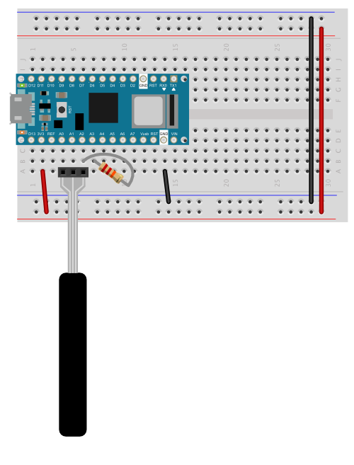
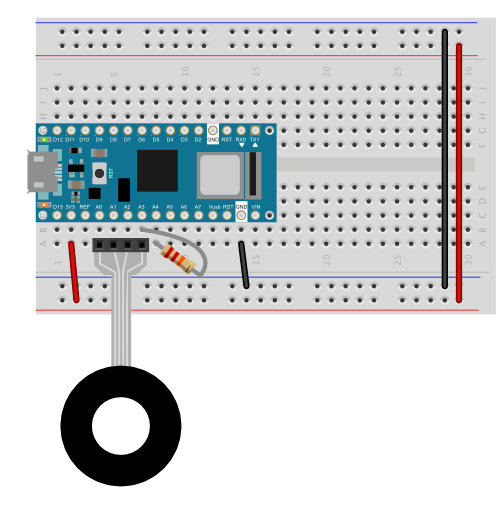

# Force Sensing Linear Potentiometers

Force sensing  linear potentiomers (FSLPs) can sense the movement of your finger along a strip of conductive rubber. They're often used as touch strips  or touch wheels like the early [iPod click wheel](https://support.apple.com/en-us/HT204217#ipod). They sense force pressing down on the sensor, like a [force-sensing resistor (FSR)](https://itp.nyu.edu/archive/physcomp-spring2014/sensors/Reports/ForceSensorResistor.html). The difference is that, in addition to detecting force, an FSLP can dectect position on one axis. They act like a mechanical potentiometer, but with no mechanics. 

Like an FSR, a force-sensing linear potentiometer is made up of a substrate of conductive rubber that changes its resistance with force. Electrically, they are a network of three resistors, as shown in Figure 1. Resistors R1 and R2 form a voltage divider. As you slide your finger along the FSLP, R1 gets larger as R2 gets smaller, just like a regular potentiometer. R3 detects the force applied to the FSLP. 

_Figure 1. Schematic diagram of a Force Sensing Linear Potentiometer_

The normal mode of use for a sensor like this is that you measure to see if there's any force applied to the sensor, meaning that someone's touching it, then you measure the position. Doing this is a bit more complex than just reading a regular potentiometer, because you have to separate the force sensing resistor from the voltage divider, reading each in turn.  Here is an [integration guide](https://www.mouser.com/pdfdocs/Ohmite-FSP-Integration-Guide-V1-0_27-03-18.pdf) from Ohmite, who make three models of this type of sensor, the FSP01CE, FSP02CE, and FSP03CE. These are available from [Digikey](https://www.digikey.com/products/en?keywords=FSLP%20ohmite) and [Mouser](https://www.mouser.com/Search/Refine?Keyword=ohmite+FSP0) among other retailers. The first two are linear and the third is round. The integration guide explains how to use them with a microcontroller.  

Marc Graham has made an [Arduino library for these models](https://m2aglabs.com/2019/08/14/using-ohmite-force-sensitive-potentiometers/) and has written a [helpful guide](https://m2aglabs.com/2019/08/14/using-ohmite-force-sensitive-potentiometers/). The examples in this directory are for use with that library. It's not in the Arduino IDE Library Manager, so you will need to [download the library](https://github.com/m2ag-labs/m2aglabs_ohmite/archive/master.zip) and click the Sketch menu, then Include LIbrary..., Add .ZIP library, select the .zip file you downloaded, and include it that way. Then you can use the examples in this directory.

Figure 2 shows the FSP01CE FSLP model connected to an Arduino Nano 33 IoT for use with the library. This circuit will work with the [FSP01CE sketch](FSP01CE-FSP02CE_example/FSP01CE-FSP02CE_example.ino). It will also work with the FSP02CE. The pins are connected as described in Table 1 below. In addition to the pins as described here, a 22 kilohm resistor connects pin A2 to pin A3. 

With the rubberized side of the sensor facing up, and the connector facing to your right, pin 1 is the bottom pin. The Nano's pins are numbered in a U pattern from top left (physical pin 1) to bottom right (physical pin 15), then from bottom right (physical pin 16) to top right (physical pin 30). 

_Figure 2. Breadboard diagram  of a Force Sensing Linear Potentiometer connected to an Arduino Nano 33 IoT_

_Table 1. Pin connections for FSP01CE to Nano 33 IoT_
| FSLP01/02CE physical pin number | Function | Nano physical pin number | Nano pin function | 
| --- | --- | --- | --- |
| 1 | Wiper | 6 |A2 | 
| 2 | V1 | 5 | A1 | 
| 3 | V2 | 4 | A0 | 

Figure 3 shows the FSP03CE FSLP model connected to an Arduino Nano 33 IoT for use with the library. This is a round sensor, and sliding a finger across it produces position values from 0 to 360. This circuit will work with the [FSP03CE sketch](FSP03CE_example/FSP03CE_example.ino). The pins are connected as described in Table 2 below. In addition to the pins as described here, a 22 kilohm resistor connects pin A3 to pin A4. 

With the rubberized side of the sensor facing up, and the connector facing to your right, pin 1 is the top pin. The Nano's pins are numbered in a U pattern as described above.

_Figure 3. Breadboard diagram  of a Force Sensing Linear Potentiometer connected to an Arduino Nano 33 IoT_

_Table 2. Pin connections for FSP03CE to Nano 33 IoT_
| FSLP03CE physical pin number | Function | Nano physical pin number | Nano pin function | 
| --- | --- | --- | --- |
| 1 | D240 | 4 |A0 | 
| 2 | D0 | 5 | A1 | 
| 3 | D120 | 6 | A2 | 
| 4 | Wiper | 7 | A3 | 
