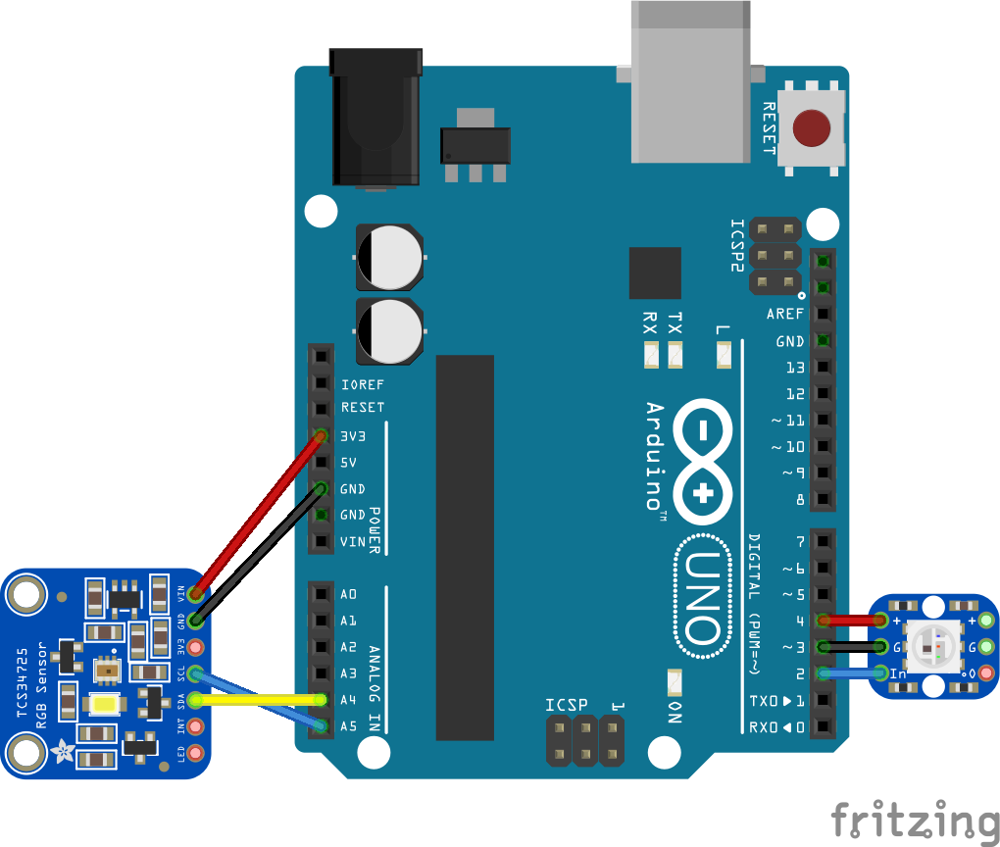

# TCS34725 Color Read Example

This Arduino example, [`TCS34725_read`](./TCS34725_read), reads the color from a TCS34725 color sensor and displays the result on a programmable WS2812 LED (NeoPixel). It also sends the data serially. The Processing sketch called [`ColorDisplayer`](ColorDisplayer) can read that string and change its background color with the color value. The Arduino sketch should work on any model of Arduino. 

## Circuit 

* TCS34725 Vin pin connected to Arduino's 3.3V pin
* TCS34725 Gnd pin connected to Arduino's ground
* TCS34725 SCL pin connected to Arduino's pin A5 (SCL)
* TCS34725 SDA pin connected to Arduino's pin A4 (SDA)
* WS2812 (NeoPixel) Vin pin connected to Arduino's pin 4
* WS2812 (NeoPixel) Gnd pin connected to Arduino's pin 3
* WS2812 (NeoPixel) data in pin connected to Arduino's pin 2.  

_Figure 1. TCS34725 sensor connected to an Arduino Uno_

## Using the Sketches 
Wire the components according to the notes above, then upload the sketch to your Arduino then open the Arduino IDE serial monitor. The sensor's white LED will light up to light whatever object that you place over the sensor so you can read the color. 

Close the serial monitor, then open Processing and open the ColorDisplayer sketch. When the ColorDisplayer sketch opens, it will list the available serial ports on your computer. Type the port number for your Arduino and then type the enter key. The color from the sensor will appear on the screen and on the LED.

