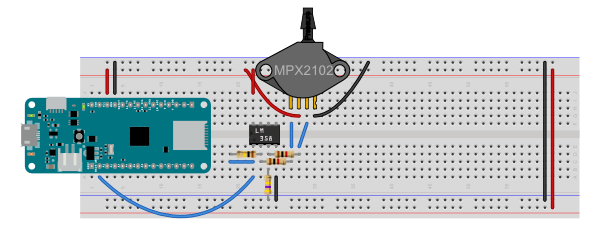

# MPX2012 Pressure Sensor

This example reads the value from an MPX2012 pressure sensor attached to a baby aspirator bulb. The result is a squeezable controller.

The pressure sensor has a typical output range of about 40mA, according to the [MPX2102 datasheet](https://www.nxp.com/docs/en/data-sheet/MPX2102.pdf). When powered at 3.3V from a MKR Zero board, the sensor's outputs output a resting voltage around 1.6V. Based on this information, I used an [op amp calculator on daycounter.com](https://www.daycounter.com/Calculators/Op-Amp/Op-Amp-Voltage-Calculator.phtml) to calculate the resistance values for a differential op amp configuration. Figures 1 and 2 below shows the configuration I ended up with. 

The LM358 op amp is powered from the Vcc pin of the microcontroller, a MKR Zero, so the voltage across the op amp is 3.3V. Pin 8 is the op amp's Vcc pin, and pin 4 is the ground. The inverting and non-inverting inputs of the op amp (pins 2 and 3) are connected to the pressure sensor's outputs through 1 kilohm resistors. A 100 kilohm resistor is the feedback resistor, connecting the op amp's output (pin 1) to the inverting input (pin 2). A 470 kilohm resistor is connected from the non-inverting input (pin 3) to ground. THe sensor is also connected to ground and Vcc on its pins 1 and 3, respectively.

Images made in Fritzing and Illustrator CS.

_Figure 1. Breadboard view ofMKR Zero and MPX2102 pressure sensor_

_Figure 2. Schematic view of MKR Zero and MPX2102 pressure sensor_
