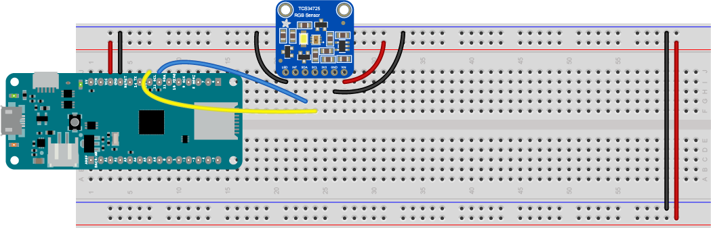

# TCS34725 RGB Color Sensor

This example reads a TCS34725 RGB Color Sensor using the Adafruit TCS34725 library. The circuit is shown in Figure 1 below. The SCL and SDA pins of the sensor are attached to the SCL and SDA pins of the microcontroller. The LED pin is attached to ground to turn the LED off. Disconnect it if you want to use the LED as a white light source.

Image made in Fritzing and Illustrator CS.

_Figure 1. Breadboard view of MKR Zero, TCS34725_

_Figure 2. Schematic view of MKR Zero, TCS34725_
